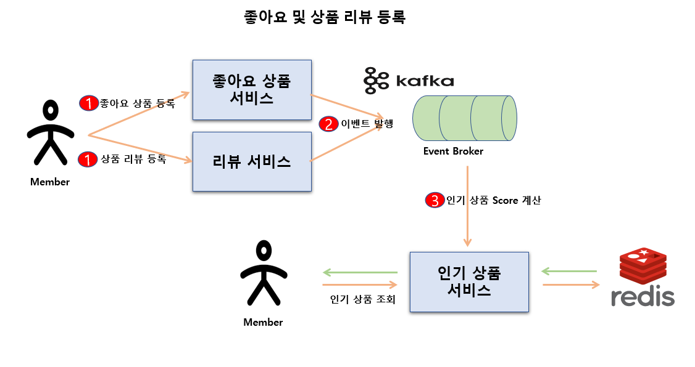

# 결제 서비스를 이용한 MSA 서비스 만들어보기

서비스는 총 8개 서비스가 존재하고 있습니다.
1. order-service - 주문 서비스 (Port: 8080)
2. catalog-service - 상품 서비스 (Port: 8081)
3. wallet-service - 지갑 서비스 (Port: 8082)
4. seller-service - 판매자 서비스 (Port: 8083)
5. hot-catalog-service - 인기 상품 서비스 (Port: 8084)
6. catalog-review-service - 리뷰 서비스 (Port: 8085)
7. catalog-like-service - 좋아요 상품 서비스 (Port: 8086)
8. order-query-service - 상품 조회 전용 서비스 (CQRS) (Port: 8087)


## 결제 시스템 설명 및 소개




대상이 되는 서비스 시스템은 결제 주문 시스템 입니다. `Seller (판매자)` 가 직접 상품을 등록 하면 `member (사용자)` 는 등록된 상품을 보고 결제를 할 수 있습니다.
결제를 하게 된다면 나중에 `Seller (판매자)` 들에게 정산 후불 처리를 하기 위해 정산 처리를 하게 됩니다.

추가적인 기능을 더 설명 하자면 사용자들은 결제 대상이 되는 상품들을 `좋아요 (찜하기)`, `리뷰 등록` 기능이 있습니다.
주문 서비스 메인 페이지에서 가장 먼저 출력되는 데이터는 가장 HOT 한 상품 목록 리스트를 출력 할 예정인데 사용자들이 `상품 결제`, `좋아요 (찜하기)`, `리뷰 등록` 하게 된다면 해당 상품의 점수 SCORE 를 계산해서 가장 HOT 상품을 출력 할 수 있도록 합니다.


이제부터 결제 시스템을 개발하기 위한 고려해야 되는 상황들을 설명 하도록 하겠습니다.

## 마이크로서비스 vs 모놀리식
상품 가입 프로세스 및 결제 시스템에 있어서 각각의 프로세스를 하나의 서버로 운영 하는것이 좋을지 (모놀리식) 아니면

각각의 서버를 분리해 마이크로서비스 통해 운영 하는것이 좋을지 고민 해보았습니다.

각각의 장단점이 있을것 같아 조사 해보았습니다.

마이크로서비스 (MSA) 의 장단점:
- 서비스를 독립적으로 배포하고 운영할 수 있다.
- 한 서비스의 장애를 격리시키기 쉽다.
- 모니터링과 디버깅이 어려울 수 있다.
- 분산 트랜잭션 문제

모놀리식의 장단점:
- 운영이 간단하다.
- 디버깅과 테스팅이 상대적으로 쉽다.
- 마이크로서비스와 달리 네트워크를 통한 통신을 사용하지 않아도 될 수 있다.
- SPOF (Single Point Of Failure)가 존재할 가능성이 있다.
- 결제 승인까지 완료가 되면 이후

정산 프로세스
결제 내역을 장부에 기록
프로세스가 진행된다고 말씀드렸습니다. 해당 프로세스 경우 결제 시스템에 가장 중요하다고 볼 수 있는 신뢰성(Reliability) 을 고려하자면 마이크로 서비스 방식으로 선택하는것이 좋아 보입니다.

하지만 마이크로서비스도 장점만 있는 것이 아닌데요. 대표적인 단점으로는 `분산 트랜잭션 (Distributed transaction)` 문제, `Data Query` 문제 등이 있습니다.

`분산 트랜잭션 (Distributed transaction)` 으로는 `Saga` 패턴으로 문제 해결 하는 방법이 있고 `Data Query` 경우 `CQRS` 통해 문제를 해결 할 수 있습니다.

이번에 만든 결제 주문 시스템 경우는 '주문 상품 Query 전용 서비스' 를 만들어서 관리 하고자 합니다.

## Database Primary PK 전략 - Snowflake 선택

Database Primary PK 전략에 있어서 주로 많이 사용하는 `Auto Increment` 전략이 있습니다. insert 할때마다 순차적으로 숫자 1씩 해서 유니크 한 값을 보장 하는 전략 입니다.
주로 데이터 타입으로는 'bigint' (64비트) 로 지정을 합니다. 하지만 이 전략은 단점이 있는데요. 


대표적으로 페이스북에 숫자로 지정된 ID 값을 볼 수 있습니다. 순차적으로 증가되는 특징을 이용해서 이 값이 클라이언트에 노출 될 경우 몇번째 가입자 인지 추측 할 수 있고 이것을 이용해 악용 할 수 있는 가능성이 있습니다.

그럼 `Auto Increment` 통해 PK 값을 지정하되 클라이언트에게 노출하는 값은 `UUID` 값으로 노출 하면 되지 않는가 생각 할 수 있겠습니다.

하지만 Mysql Index 특징을 확인 해보면 그렇게 좋지 않는 성능을 보여주는지 확인 할 수 있겠습니다.


Mysql InnoDB 기준으로 특정 테이블에 `UUID` 값을 이용해 특정 데이터를 조회를 하게 된다면 해당 값은 unique 로 지정 했기 때문에 `Secondary Index` 통해 조회를 먼저 하고

가장 끝자리에 있는 `Leaf Node` 에 포인터 (PK 값) 값이 존재하기 때문에 이때 비로써 `Clustered_Index` 까지 가서 인덱스 탐색 후 실질적인 데이터를 조회 하게 됩니다.

즉 `Secondary Index` -> `Clustered_Index` 까지 두번 인덱스 트리를 탐색 해야 하는 단점이 있습니다.

하지만 맨 처음부터 PK 값을 이용해서 조회를 할 경우 `Clustered_Index` 에서 단 한번 인덱스 트리 탐색으로 조회 할 수 있습니다.

반대로 PK 값을 `UUID` 값으로 지정하면 되지 않을까 생각 할 수 있는데요. `UUID` 값 경우는 정렬된 값이 아니기 때문에 인덱스 탐색에 있어서 단점이 될 수 있겠습니다.

그리고 MySQL 서버에서는 `UUID` 값이 `Primary key` 컬럼 으로 사용되는 경우 경우에 모든 `Secondary Index` 는 primary key 값을 포함하게 되는데요.
특징상 `UUID` 값 경우 값이 크기 때문에 `Secondary Index` 크기가 커질수 있는 단점이 있습니다.

대체 가능한 방법으로는 `Snowflake` 로 이용해서 PK 전략을 수립 할 수 있습니다. `UUID` 값으로 유니크한 값을 보장 하고 시간 기반 순차성도 보장 하기 떄문에 `b+tree` 알고리즘을 이용한 Mysql Index 탐색에 있어서 성능을 향상 시킬수 있겠습니다.
그리고 `Auto Increment` 에서 보통 사용되는 데이터 타입 'bigint' (64비트) 와 동일하게 64비트로 구성 되어 있습니다.

## 대규모 트래픽 대비해서 EDA (Event Driven Architecture) 도입

대량의 트래픽 요청이 들어오면 이에 대응 하는 방법이 여러가지 있겠지만 대표적으로 서버 `Scale-Out` 으로 요청량을 분할 해서 대응 할 수 있습니다.
하지만 `Scale-Out` 해도 요청량이 갑자기 급변 할때 즉 확장의 속도가 요청량의 속도를 따라잡지 못 할때가 있습니다. 확장이 빨리 되지 않으므로 서버 증설까지 기존 서버로 대응 해야 한다는 점인데요.


이러한 단점들을 보완 할 수 있는 방법은 여러가지 있겠지만 `EDA (Event Driven Architecture)` 통해 대응 할 수 있습니다.

EDA 란 메시지 (이벤트) 기반으로 비동기 통신을 이용해서 상호작용 하는 구조 입니다. 중요한것은 메시지 (이벤트) 기반이고 비동기 통신으로 이루어져 있다는 점 입니다.

이러한 이벤트 기반 처리 방식으로 가져올수 있는 장점은 급변하게 급등하는 요청량에 대한 탄력적으로 대응이 가능 한다는 점 입니다. 만약 대량의 트래픽 요청이 있으면
해당 메시지들은 Event Broker 에 일단 일정 시간 동안 보관하게 될것이고 Consume 하는 입장인 서버들은 자기 페이스 조절에 맞게 메시지를 가져와서 처리 할 수 있다는 것 입니다.

## 메시지 전달 보장 (Message Delivery Guarantees) 고려 해보기

메시지 전달 보장 (Message Delivery Guarantees) 수준에 대해 고려 해야 합니다. 다음 3가지 수준이 있는데요.

1. At-most-once (최대 한번)

메시지를 최대 한번만 전송 하게 됩니다. (딱 한 번만 전송 합니다.) 한번만 처리 되기 때문에 그만큼 오버헤드가 없다고 볼수 있고 구현이 간단 합니다.

2. At-least-once (최소 한번)

최소 한번이므로 여러번 호출을 통해 누락되지 않도록 합니다.

3. Exactly-once (정확히 한번)

메시지를 정확히 한 번만 전송 하지만 정확하게 누락없이 메시지를 전달 할 수 있어야 합니다.

결제 시스템 경우는 이벤트 메시지 발행시 누락없이 전송 해야 합니다. 결제 경우는 비용 관련 민감한 데이터를 조작 하는 일이 많아 메시지는 분명하게 전달 되어야 합니다.
그래서 `At least once (최소 한 번)` 적절하다고 생각 했습니다.

하지만 여러번 호출 한다고 하면 결제 관련 데이터 일관성 문제로 이어질수 있습니다. 이러한 문제는 `멱등성` 그리고 `Optimistic Locking` 을 이용해서 해결 하고자 합니다.

## Idempotency (멱등성)

멱등성 처리은 요청이 여러 번 들어와도 딱 한번만 처리하도록 설계하는 방식을 의미 합니다.


예를 들어 최종 결제 승인을 위해 PSP 에 요청시 결제 승인 이후 내부적으로 Exception 이 발생되거나 그리고 실제로는 결제 승인이 되었지만 PSP 사로부터 응답시
timeout 발생으로 재시도 할 필요가 있습니다.

이때 만약 재시도 하게 된다면 두번 결제 승인 요청을 하지 않도록 해야 합니다. 그래서 멱등성 키 값을 이용해서 PSP 사부터 최초 요청 할때 사용된 멱등성 키 값으로
다시 요청 할 것이고 동일한 키값으로 요청 할 수 없다는 응답을 받게 하므로써 결제 재등록을 방지 하도록 합니다.

결제 관련 데이터 베이스 테이블에 insert 할때도 멱등성 키값을 잘 활용 할 수 있습니다. 멱등성 키값 통해 유니크한 칼럼으로 설정하면 2번 이상 insert 시 무결성 제약 조건으로 인해 실패하게 하도록 합니다.


## Optimistic Locking 이용해서 데이터 일관성 유지하기


`Payment Server` 에서 `Event Broker` 로 정산 프로세스 진행 하기 위해 이벤트 메시지 발행 하는 과정에서 동일한 시간에 특정 Seller 에 포함된
서로 다른 각각의 주문 한 내역을 가지고 특정 Seller 에 최종 balance 데이터 업데이트시 동시성 문제인 `lost update` 가 발생 할 수 있습니다.

이러한 문제를 해결하기 위해서는 `Optimistic Locking` 을 이용해서 해결 하고자 합니다. `wallet` 테이블에 `version` 이라는 필드를 추가해서
동시성 문제를 해결하는 메카니즘 인데요. 동일한 version 으로 데이터 업데이트시  `OptimisticLockingException` 발생시켜 문제를 해결하는 것 입니다.

해당 Exception 이 발생 시키면 Retry 이용해서 다시 최신 해당 wallet 의 balance 데이터 값을 조회 해서 계산 하도록 합니다.

동시화 기법에 있어서 여러가지 방법이 있지만 이러한 이슈 경우 빈번하게 발생하지 않을 것 같아 `Optimistic Locking` 기법으로 선택 하였습니다.

## Retry Queue 와 Dead Letter Queue 이용해서 메시지 보장 획득 하기

`wallet server` 역활은 `payment server` 에서 이벤트 메시지를 발행하면 `wallet server` 는 해당 메시지를 수신 해서 정산 프로세스를 진행 합니다.
하지만 정산 프로세스 진행 하는 과정에서 예상치 않는 에러로 인해서 문제가 발생 해서 방치 하게 된다면 최종 결제에 있어서 데이터 일관성 문제가 발생 하게 됩니다.

에러 발생시 이에 대한 후속 처리를 해야 하는데요. 이와 대응 하는 방법으로는 `Retry Queue` 를 이용해서 다시 재시도를 하도록 합니다.

`재시도 제한 횟수`를 3회까지만 지정하고 이후 실패시에는 `Dead Letter Queue` 에 따로 보관해서 이후 개발자가 수동으로 처리 하도록 하였습니다.

즉 이벤트 발생하고 이에 수신 해서 처리하는 과정까지 이 과정에서 에러가 발생된다면 이에 대한 후속 처리를 할 수 있도록 프로세스를 개선 하도록 합니다.

```javascript
@Configuration
@EnableKafka
public class KafkaConfig {

    // ...생략...

    @Bean
    @Primary
    CommonErrorHandler errorHandler(KafkaTemplate<String, Object> kafkaTemplate) {
        CommonContainerStoppingErrorHandler cseh = new CommonContainerStoppingErrorHandler();
        AtomicReference<Consumer<? ,?>> consumer2 = new AtomicReference<>();
        AtomicReference<MessageListenerContainer> container2 = new AtomicReference<>();

        DefaultErrorHandler errorHandler = new DefaultErrorHandler((rec, ex) -> {
            cseh.handleRemaining(ex, Collections.singletonList(rec), consumer2.get(), container2.get());
        }, generateBackOff()) {

            @Override
            public void handleRemaining(
                Exception thrownException,
                List<ConsumerRecord<?, ?>> records,
                Consumer<?, ?> consumer,
                MessageListenerContainer container
            ) {

                for (ConsumerRecord<?, ?> record : records) {
                    kafkaTemplate.send(record.topic() + ".DLT", (String) record.key(), record.value());
                }

                consumer2.set(consumer);
                container2.set(container);
                super.handleRemaining(thrownException, records, consumer, container);
            }
        };
        errorHandler.addNotRetryableExceptions(JsonProcessingException.class);
        return errorHandler;
    }

    @Bean
    @Primary
    public ConcurrentKafkaListenerContainerFactory<String, Object> kafkaListenerContainerFactory(
        ConsumerFactory<String, Object> consumerFactory,
        CommonErrorHandler errorHandler
    ) {
        ConcurrentKafkaListenerContainerFactory<String, Object> factory = new ConcurrentKafkaListenerContainerFactory<>();
        factory.setConsumerFactory(consumerFactory);
        factory.setCommonErrorHandler(errorHandler);
        factory.getContainerProperties().setAckMode(ContainerProperties.AckMode.MANUAL_IMMEDIATE);
        
        return factory;
    }

    private BackOff generateBackOff() {
        ExponentialBackOff backOff = new ExponentialBackOff(1000, 2);
        backOff.setMaxAttempts(3);
        return backOff;
    }
```

지수백오프 기능을 이용해서 재시도에서 다음 재시도까지 시간 간격을 조정하는 것이 가능 합니다. 그리고 만약 지정된 재시도 횟수가 넘어가면
해당 Kafka Topic 으로부터 발생한 이벤트 토픽명을 `.DLT` 붙여서 해당 Topic 에 저장 하도록 합니다. 


## Transaction OutBox Pattern 도입하기

결제 승인이 완료되고 이후 @Transaction 영역 안에서 처리 해야 하는 프로세스는 다음과 같습니다.

1. 결제 승인 결과에 따른 결제 상태 업데이트
2. 정산 처리 이벤트 메시지 발행


둘중에 하나라도 실패가 된다고 하면 진행 했던 프로세스를 모두 롤백 해야 합니다. 예를들어서 `정산 처리 이벤트 메시지 발행` 성공적으로 진행하고
`결제 승인 결과에 따른 결제 상태 업데이트` 진행하는 과정에 에러가 발생 된다고 하면 `정산 처리 이벤트 메시지 발행` 처리는 롤백 해야 합니다. 하지만
메시지 발행 된건은 롤백이 쉽지 않습니다.

반대로 순서를 바꾸어서 `결제 승인 결과에 따른 결제 상태 업데이트` 성공적으로 처리되고 `정산 처리 이벤트 메시지 발행` 처리 하는 과정에서 문제가 발생되면
`결제 승인 결과에 따른 결제 상태 업데이트` 프로세스는 데이버베이스 Transaction 원리로 롤백이 가능 할것 입니다.

하지만 `정산 처리 이벤트 메시지 발행` 프로세스 까지 처리가 완료되고 이후 `commit` 하는 과정에서 문제가 발생 된다면 `정산 처리 이벤트 메시지 발행` 프로세스는 롤백이 되어야 하는데 쉽지 않습니다.

이러한 문제를 해결하기 위해 `Transactional Outbox Pattern` 을 사용 합니다.


`Transactional Outbox Pattern` 경우 메시지 큐에 발행할 이벤트 메시지 내용을 `outbox` 테이블에 저장하고 트랜잭션에 포함 하도록 합니다.

만약 이후 프로세스가 하나라도 실패할 경우 `outbox` 테이블에 저장 했던 프로세스는 롤백이 되고 결국 메시지 발행은 하지 않도록 됩니다.

## Scale-out 통한 중복 메시지 발행 문제


만약에 Scale-out 통한 2 개의 APP (reviews service) 그리고 테이블 (reviews 서비스 전용 DB 서버에 해당되는 outbox 테이블) 4개로 샤딩으로 구성 되어 있다고 가정 하겠습니다.

이 상황에서 리뷰 등록을 한 다음에 바로 hot catalog 계산하기 위해 kafka 통해 메시지 발행을 했는데 실패 했다고 가정 하겠습니다.
실패한 메시지 경우 정해진 반복 scheduler 통해 해당 outbox 테이블에 조회 해서 아직 메시지가 발행 하지 않는 데이터를 찾아서 message broker 에 메시지를 발행 하게 됩니다.

하지만 지금과 같이 2 개의 APP 에서 동시적으로 outbox 테이블에 조회해서 메시지를 발행 한다면 중복 메시지 발행으로 이어지게 됩니다.


이를 회피하기 위해 `message relay cordinator` 를 도입 할려고 합니다. 3초 간격으로 해당 리뷰 서비스 APP 전체적으로 APP 이 지금 몇개 띄어져 있는지 아니면 어느 몇개가 APP 이 삭제되었는지 지속적으로 체크를 하게 됩니다.

그런 다음 `리뷰 outbox 테이블 샤딩 갯수`, `리뷰 APP 갯수` 값을 이용해서 특정 APP 이 담당해야 하는 샤딩을 번호를 부여 받게 됩니다.

```mysql
long start = #{APP Index} * #{총 샤딩 갯수} / #{리뷰 APP 총 갯수};
long end = (#{APP Index} + 1) * #{총 샤딩 갯수} / #{리뷰 APP 총 갯수} - 1;
```

이렇게 각 APP Index 마다 정해진 샤딩 만큼 부여 받으므로써 적절하게 분산해 중복 메시지를 회피 하도록 개선 해보았습니다. 


## 결제 시스템 Sequence Diagram


고객이 결제 요청이 들어오면 결제 요청 데이터 기반으로 Toss 페이먼츠에 결제 승인 요청을 합니다. 결과 응답이 전달 받으면 이에 따른 결제 상태 업데이트 작업이
이루어 집니다. 동시에 이벤트 메시지 발행 앞서 이벤트 메시지 내역을 OutBox 데이터 베이스 테이블에 저장 합니다.

그 다음 `Kafka Event Broker` 에 이벤트 메시지 발행 하도록 합니다. 동시에 고객에게 결제 진행 데이터를 응답 하게 됩니다.

## 정산 시스템 Sequence Diagram


결제 진행 후 `Kafka Event Broker` 에 정산 프로세스를 진행 하기 위한 이벤트 메시지 발행한 것을 수신 받아 처리 하게 됩니다.
해당 주문 아이디값을 이용해 이미 진행한 정산인지 체크를 하고 진행하지 않았던 주문 아이디값이라면 주문 내역을 조회해서 각각의 판매자 (Seller) 에 포함된
balance 데이터 값을 계산해서 업데이트를 하도록 합니다.


---

#### Skill & Tools - Backend
- Java 17
- Spring boot 3.2.0
- Junit5
- JPA
- QueryDsl
- Mysql 8.x
- zookeeper
- Kafka
- kafka-ui
- docker
- Redis


#### Execution
```
./gradlew docker
docker-compose up -d
```

#### FrontEnd Service Endpoint
- 결제 하기
  - POST http://localhost:8080 접속 및 결제 하기

# API Reference

<details markdown="1">
<summary>자원 <-- <b>클릭하면 목록이 나타납니다!!</b> </summary>

<details markdown="1" style="margin-left:14px">
<summary>상품 리뷰 등록</summary>

**상품 리뷰 등록**
----
상품 리뷰 등록합니다.

* **URL**

  http://localhost:8085/api/product-reviews

* **Method:**

  `POST`

* **Data Params**
  
  **Required:**

  `productNo=[Integer] - 상품 PK 값`  
  `memberNo=[Integer] - 사용자 PK 값`  
  `title=[String] - 리뷰 제목`  
  `content=[String] - 리뷰 내용`  
  `starRatingType=[String] - 리뷰 평점 (ONE, TWO, THREE, FOUR, FIVE)`

* **예시**
```json
  "productNo": "23423958235",
  "memberNo": "2342352652",
  "title": "타이블11",
  "content": "내용22",
  "starRatingType": "FIVE"
```
</details>

<details markdown="1" style="margin-left:14px">
<summary>상품 좋아요 등록</summary>

**상품 좋아요 등록**
----
상품 좋아요 등록합니다.

* **URL**

  http://localhost:8086/api/catalog-likes/products/{productNo}/members/{memberNo}

* **Method:**

  `POST`

* **Data Params**

  **Required:**

  `productNo=[Integer] - 상품 PK 값 (products 테이블 PK 값)`  
  `memberNo=[Integer] - 사용자 PK 값 (members 테이블 PK 값)`
</details>

<details markdown="1" style="margin-left:14px">
<summary>hot 상품 조회</summary>

**hot 상품 조회**
----
hot 상품 조회 합니다.

* **URL**

  http://localhost:8084/api/hot-products

* **Method:**

  `GET`
</details>


<details markdown="1" style="margin-left:14px">
<summary>주문 조회 (첫번째 페이지)</summary>

**주문 조회 (첫번째 페이지)**
----
주문 조회 (첫번째 페이지) 합니다.

* **URL**

  http://localhost:8087/api/orders/members/#{memberNo}

* **Method:**

  `GET`
* 
* **Data Params**

  **Required:**

  `memberNo=[Integer] - 사용자 PK 값 (members 테이블 PK 값)`
</details>

<details markdown="1" style="margin-left:14px">
<summary>주문 조회 (두번째 페이지)</summary>

**주문 조회 (두번째 페이지)**
----
주문 조회 (두번째 페이지) 합니다.

* **URL**

  http://localhost:8087/api/orders/members/#{memberNo}?paymentEventNo=#{paymentEventNo}&createdDateTime=#{createdDateTime}&limit=#{limit}
* **Method:**

  `GET`
*
* **Data Params**

  **Required:**

  `memberNo=[Integer] - 사용자 PK 값 (members 테이블 PK 값)`
  `paymentEventNo=[Integer] - 이전에 출력된 가장 payment_events 테이블 PK 값`
  `createdDateTime=[Integer] - 이전에 출력된 가장 마지막 생성 날짜`
  `limit=[Integer] - 출력 할 limit 값`
</details>

<details markdown="1" style="margin-left:14px">
<summary>주문 상세 조회</summary>

**주문 상세 조회**
----
주문 상세 조회 합니다.

* **URL**

  http://localhost:8087/api/orders/payment-events/#{paymentEventNo}/members/#{memberNo}
* **Method:**

  `GET`
*
* **Data Params**

  **Required:**

  `memberNo=[Integer] - 사용자 PK 값 (members 테이블 PK 값)`
  `paymentEventNo=[Integer] - 이전에 출력된 가장 payment_events 테이블 PK 값`
</details>

</details>


#### Service Endpoint
- Mysql
  - http://localhost:3306
  - id: root 
  - password: 1234
- zookeeper
  - http://localhost:32181
- Kafka
  - http://localhost:9092, http://localhost:9093, http://localhost:9094
- Kafka UI
  - http://localhost:8989
- redis
  - http://localhost:6379

#### DB initial settings
```mysql
create schema payment_msa_v2_order;
create schema payment_msa_v2_catalog;
create schema payment_msa_v2_wallet;
create schema payment_msa_v2_catalog_review;
create schema payment_msa_v2_catalog_like;
create schema payment_msa_v2_seller;

create table payment_msa_v2_order.payment_events
(
  payment_event_no bigint                               not null
    primary key,
  member_no        bigint                               null,
  is_payment_done  tinyint(1) default 0                 not null,
  is_wallet_done   tinyint(1) default 0                 not null,
  payment_key      varchar(255)                         null,
  order_id         varchar(255)                         null,
  type             enum ('NORMAL')                      not null,
  order_name       varchar(255)                         null,
  method           enum ('CARD')                        null,
  approved_at      datetime                             null,
  created_at       datetime   default CURRENT_TIMESTAMP not null,
  updated_at       datetime   default CURRENT_TIMESTAMP not null,
  constraint order_id
    unique (order_id),
  constraint payment_key
    unique (payment_key)
);

create table payment_msa_v2_order.payment_orders
(
  payment_order_no     bigint                                                                                       not null
    primary key,
  payment_event_no     bigint                                                                                       not null,
  product_no           bigint                                                                                       not null,
  seller_no            bigint                                                                                       null,
  order_id             varchar(255)                                                                                 not null,
  product_name         varchar(100)                                                                                 null,
  amount               decimal(12, 2)                                                                               not null,
  payment_order_status enum ('NOT_STARTED', 'EXECUTING', 'SUCCESS', 'FAILURE', 'UNKNOWN') default 'NOT_STARTED'     not null,
  failed_count         tinyint                                                            default 0                 not null,
  threshold            tinyint                                                            default 5                 not null,
  created_at           datetime                                                           default CURRENT_TIMESTAMP not null,
  updated_at           datetime                                                           default CURRENT_TIMESTAMP not null
);

create table payment_msa_v2_order.payment_order_histories
(
  payment_order_history_no bigint                                                             not null
    primary key,
  payment_order_no         bigint                                                             not null,
  previous_status          enum ('NOT_STARTED', 'EXECUTING', 'SUCCESS', 'FAILURE', 'UNKNOWN') null,
  new_status               enum ('NOT_STARTED', 'EXECUTING', 'SUCCESS', 'FAILURE', 'UNKNOWN') null,
  created_at               datetime default CURRENT_TIMESTAMP                                 not null,
  updated_at               datetime default CURRENT_TIMESTAMP                                 not null,
  changed_by               varchar(255)                                                       null,
  reason                   varchar(255)                                                       null
);

create table payment_msa_v2_order.outbox
(
  outbox_no       bigint                              not null
    primary key,
  shard_key       bigint                              not null,
  event_type      varchar(100)                        not null,
  idempotency_key varchar(128)                        null,
  status          enum ('INIT', 'FAILURE', 'SUCCESS') not null,
  type            varchar(50)                         null,
  partition_key   int                                 null,
  payload         longtext                            null,
  metadata        longtext                            null,
  created_at      datetime default CURRENT_TIMESTAMP  not null,
  updated_at      datetime default CURRENT_TIMESTAMP  not null on update CURRENT_TIMESTAMP,
  constraint idempotency_key
    unique (idempotency_key)
);

create table payment_msa_v2_catalog.products
(
  product_no bigint                             not null
    primary key,
  seller_no  bigint                             null,
  product_id varchar(255)                       not null,
  name       varchar(50)                        not null,
  price      decimal(12, 2)                     not null,
  created_at datetime default CURRENT_TIMESTAMP not null,
  updated_at datetime default CURRENT_TIMESTAMP not null
);


create table payment_msa_v2_catalog_like.product_likes
(
  product_like_no bigint   not null
    primary key,
  product_no      bigint   not null,
  member_no       bigint   not null,
  created_at      datetime not null,
  updated_at      datetime null,
  constraint idx_product_no_member_no
    unique (product_no, member_no)
);

create table payment_msa_v2_catalog_like.product_like_counts
(
  product_no bigint                             not null
    primary key,
  like_count bigint                             not null,
  version    bigint                             not null,
  created_at datetime default CURRENT_TIMESTAMP not null,
  updated_at datetime default CURRENT_TIMESTAMP not null on update CURRENT_TIMESTAMP
);

create table payment_msa_v2_catalog_like.outbox
(
  outbox_no       bigint                              not null
    primary key,
  shard_key       bigint                              not null,
  event_type      varchar(100)                        not null,
  idempotency_key varchar(128)                        null,
  status          enum ('INIT', 'FAILURE', 'SUCCESS') not null,
  type            varchar(50)                         null,
  partition_key   int                                 null,
  payload         longtext                            null,
  metadata        longtext                            null,
  created_at      datetime default CURRENT_TIMESTAMP  not null,
  updated_at      datetime default CURRENT_TIMESTAMP  not null on update CURRENT_TIMESTAMP,
  constraint idempotency_key
    unique (idempotency_key)
);


create table payment_msa_v2_catalog_review.product_reviews
(
  product_review_no bigint                             not null
    primary key,
  product_no        bigint                             not null,
  member_no         bigint                             not null,
  title             varchar(100)                       not null,
  content           varchar(3000)                      not null,
  star_rating       bigint                             not null,
  is_deleted        tinyint(1)                         not null,
  created_at        datetime default CURRENT_TIMESTAMP not null,
  updated_at        datetime default CURRENT_TIMESTAMP not null on update CURRENT_TIMESTAMP
);

create table payment_msa_v2_catalog_review.product_review_counts
(
  product_no             bigint                             not null
    primary key,
  review_count           bigint                             not null,
  review_star_rating_sum bigint                             not null,
  version                bigint                             not null,
  created_at             datetime default CURRENT_TIMESTAMP not null,
  updated_at             datetime default CURRENT_TIMESTAMP not null on update CURRENT_TIMESTAMP
);

create table payment_msa_v2_catalog_review.outbox
(
  outbox_no       bigint                              not null
    primary key,
  shard_key       bigint                              not null,
  event_type      varchar(100)                        not null,
  idempotency_key varchar(128)                        null,
  status          enum ('INIT', 'FAILURE', 'SUCCESS') not null,
  type            varchar(50)                         null,
  partition_key   int                                 null,
  payload         longtext                            null,
  metadata        longtext                            null,
  created_at      datetime default CURRENT_TIMESTAMP  not null,
  updated_at      datetime default CURRENT_TIMESTAMP  not null on update CURRENT_TIMESTAMP,
  constraint idempotency_key
    unique (idempotency_key)
);

create table payment_msa_v2_seller.sellers
(
  seller_no  bigint                               not null
    primary key,
  seller_id  varchar(128)                         not null,
  created_at datetime   default CURRENT_TIMESTAMP not null,
  updated_at datetime   default CURRENT_TIMESTAMP not null on update CURRENT_TIMESTAMP,
  is_deleted tinyint(1) default 0                 null,
  constraint sellerId
    unique (seller_id)
);

create table payment_msa_v2_wallet.wallets
(
  wallet_no  bigint                             not null
    primary key,
  seller_no  bigint                             not null,
  balance    decimal(38, 2)                     null,
  version    int      default 0                 not null,
  created_at datetime default CURRENT_TIMESTAMP not null,
  updated_at datetime default CURRENT_TIMESTAMP not null on update CURRENT_TIMESTAMP,
  constraint user_id
    unique (seller_no)
);

create table payment_msa_v2_wallet.wallet_transactions
(
  wallet_transaction_no bigint                             not null
    primary key,
  wallet_no             bigint                             not null,
  amount                decimal(38, 2)                     null,
  type                  enum ('CREDIT', 'DEBIT')           not null,
  reference_id          bigint                             not null,
  reference_type        varchar(58)                        not null,
  order_id              varchar(255)                       null,
  idempotency_key       varchar(255)                       null,
  created_at            datetime default CURRENT_TIMESTAMP null,
  updated_at            datetime default CURRENT_TIMESTAMP null,
  constraint idempotency_key
    unique (idempotency_key)
);

create table payment_msa_v2_wallet.outbox
(
  outbox_no       bigint                              not null
    primary key,
  shard_key       bigint                              not null,
  event_type      varchar(100)                        not null,
  idempotency_key varchar(128)                        null,
  status          enum ('INIT', 'FAILURE', 'SUCCESS') not null,
  type            varchar(50)                         null,
  partition_key   int                                 null,
  payload         longtext                            null,
  metadata        longtext                            null,
  created_at      datetime default CURRENT_TIMESTAMP  not null,
  updated_at      datetime default CURRENT_TIMESTAMP  not null on update CURRENT_TIMESTAMP,
  constraint idempotency_key
    unique (idempotency_key)
);

INSERT INTO payment_msa_v2_seller.sellers (seller_no, seller_id, created_at, updated_at) VALUES (1, 'A', '2024-11-28 22:55:09', '2024-11-28 22:55:09');
INSERT INTO payment_msa_v2_wallet.wallets (wallet_no, seller_no, balance, version, created_at, updated_at) VALUES (1, 1, 0, 0, '2024-11-28 22:55:09', '2024-11-28 22:55:09');
INSERT INTO payment_msa_v2_catalog.products (product_no, seller_no, product_id, name, price, created_at, updated_at) VALUES (1, 1, 'A', '상품A', 1000.00, '2024-11-28 22:55:09', '2024-11-28 22:55:09');
INSERT INTO payment_msa_v2_catalog.products (product_no, seller_no, product_id, name, price, created_at, updated_at) VALUES (2, 1, 'B', '상품B', 2000.00, '2024-11-28 22:55:09', '2024-11-28 22:55:09');
INSERT INTO payment_msa_v2_catalog.products (product_no, seller_no, product_id, name, price, created_at, updated_at) VALUES (3, 1, 'C', '상품C', 3000.00, '2024-11-28 22:55:09', '2024-11-28 22:55:09');
```


